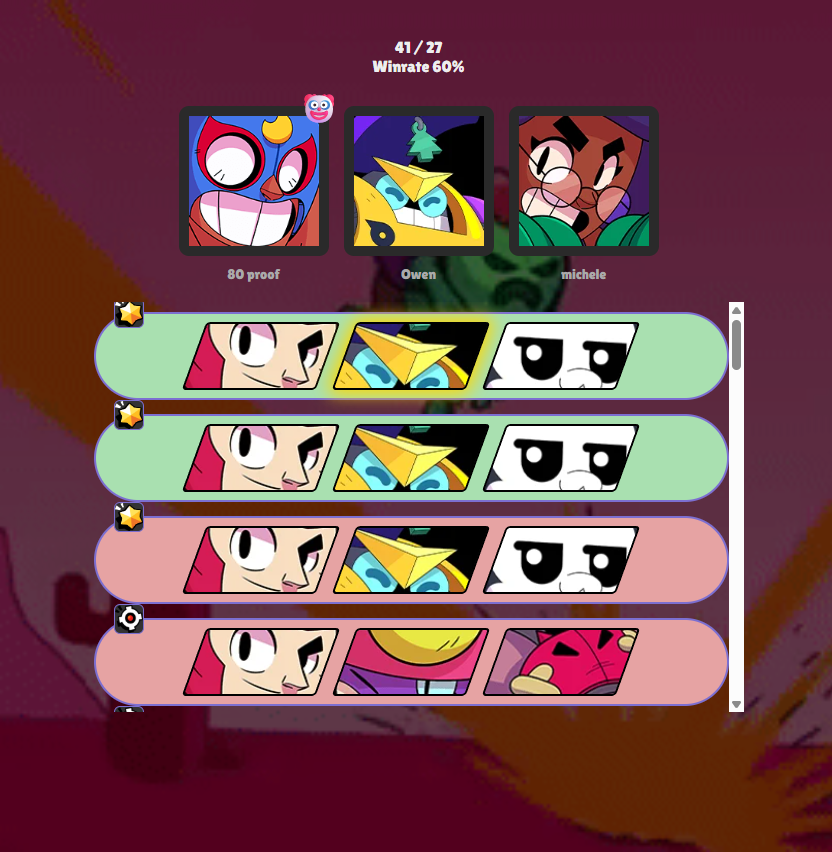
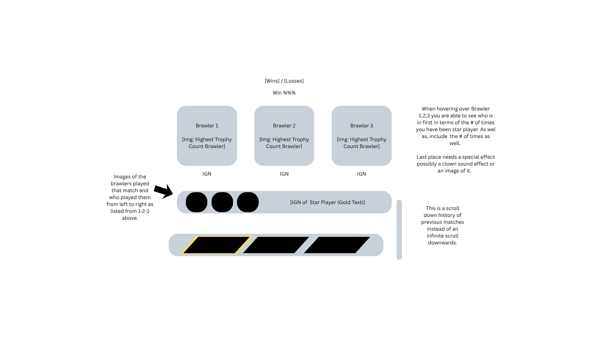

# Brawl Stars Trio Tracker

A live dashboard that tracks win/loss record, star player counts, and match history for a fixed group of three Brawl Stars players ("a trio"). Built with a Python/Flask backend that polls the official Brawl Stars API on a background thread, and a lightweight vanilla JS frontend that auto-refreshes to show live stats.



## Features

- **Background polling** — a daemon thread checks the Brawl Stars battle log every 30 seconds without blocking the web server
- **Trio detection** — automatically filters a player's battle log down to matches where all three tracked players were on the same team
- **Persistent state** — win/loss record and match history are saved to disk so stats survive restarts
- **Live dashboard** — auto-refreshing frontend showing current record, win rate, top brawler per player, star player rankings, and a scrollable match history with mode icons and win/loss coloring
- **No hardcoded secrets** — API key and player tags are loaded from a local config file that's excluded from version control

## Tech stack

- **Backend:** Python, Flask, `requests`
- **Frontend:** vanilla HTML/CSS/JavaScript (no build step, no framework)
- **Data sources:** [Brawl Stars API](https://developer.brawlstars.com/) (official) and [BrawlAPI](https://brawlapi.com/) (game mode icons)

## How it works

1. On startup, the app loads an API key and three player tags from `config.json`.
2. A background thread polls one player's battle log every 30 seconds.
3. Each new battle is checked against the other two players' tags — if all three were on the same team, it counts toward the trio's win/loss record and star player stats.
4. Results are cached in memory, written to disk, and served to the frontend via a `/api/state` JSON endpoint.
5. The frontend polls that endpoint on an interval and re-renders the dashboard — no page reloads.

## Design Draft

Early wireframe/mockup before implementation:



## Setup

### 1. Get a Brawl Stars API key

Sign up at [developer.brawlstars.com](https://developer.brawlstars.com/) and create a key, allowlisting the IP address you'll run the app from.

### 2. Clone and install dependencies

```bash
git clone https://github.com/rehanNY06/Brawlstars-Trio-Tracker.git
cd Brawlstars-Trio-Tracker
pip install -r requirements.txt
```

### 3. Configure your players

```bash
cp config.example.json config.json
```

Edit `config.json` with your real API key and player tags:

```json
{
  "brawlstars_api_key": "YOUR_API_KEY_HERE",
  "trio_tags": ["#YOURTAG", "#FRIEND1TAG", "#FRIEND2TAG"]
}
```

### 4. Run it

```bash
python app.py
```

Visit `http://localhost:5000`.

## Project structure

```
Brawlstars-Trio-Tracker/
├── app.py                  # Flask app + polling logic
├── config.example.json     # Template config (copy to config.json)
├── requirements.txt
├── templates/
│   └── dashboard.html
└── static/
    ├── style.css
    └── script.js
```

## Notes

- Only tracks matches where all three players are on the same team.
- `trio_state.json` and `config.json` are gitignored since they contain personal match history and an API key, respectively.
- The Brawl Stars API key allowlists specific IPs, so this needs reconfiguring if deployed anywhere other than the machine it was created on.

## License

MIT